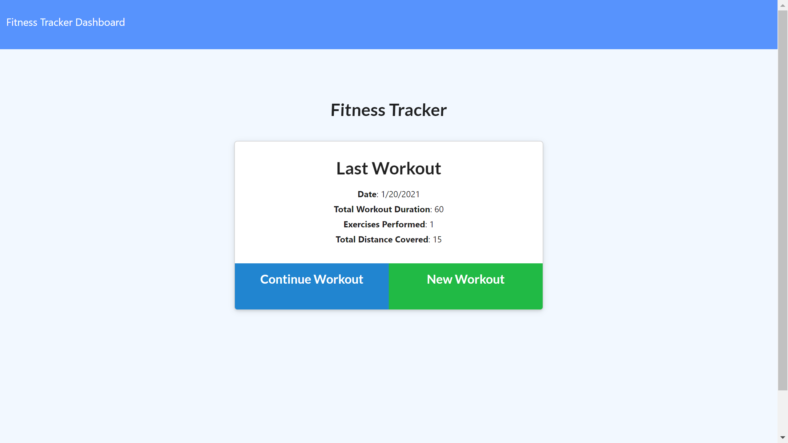
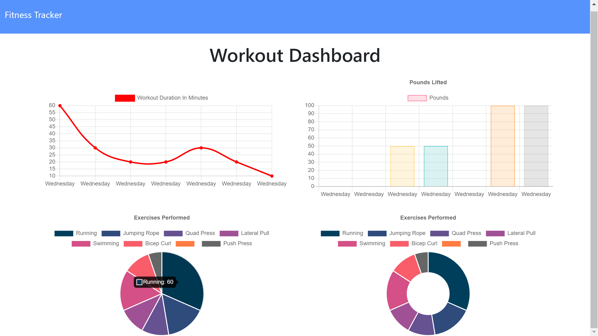

# Workout Tracker : MongoDB & Mongoose

## Description

A user can be motivated by using this Workout Tracker Application to track his/her resistance and cardio exercises and workouts progress in order to successfully reach his/her fitness goals.

## Table of Contents

- [Build-In](#Build-In)
- [Installation](#Installation)
- [Useage](#Useage)
- [Screenshots](#screenshots)
- [Demo](#demo)
- [Deploy](#Deploy) - [Heroku](https://fathomless-scrubland-37701.herokuapp.com/?id=6008cd63a077450015712163)
- [License](#license)
- [Questions](#questions)

# Build-In

This Workout Tracker application is a full-stack web application. The data of workouts is saved in a `Mongo database`. The following technologies are used in this application:

- `NodeJS` : Dependencies for this project include the node modules:

  - `Mongoose` for setting up the models for `MongoDB` ( NoSQL)
  - `Express`: for setting up the node server
  - `Morgan` for adding the http request logger

- Chart.js: Used to build multiple visualized charts for each workout and exercise

## Installation

- `Git clone` the app repo to your local machine
- Run `npm install` in your terminal
- After the `dependencies` have been installed , then run `node seeders/seed.js`
- If `seed` is successful run, then start your `server` by doing `node server.js`.

## Usage

- This workout tracker application is a useful application for user to create, track, and view his/her resistance and cardio exercises up to the last seven workouts.

- When the user give his/her workout data through submitting the New Workout form or the Continue Workout form in the `initial page` of this application, then this application will generate the summary of the last workout which will be displayed with details that include the date and the duration, and the make up’s data of weight, sets, reps, and distance in the Last Workout area.

- user is able to track the data of exercises performances, the data of workout durations, and the data of pounds lifted of resistance exercises, up to the last 7 workouts through the visualized two pie charts, one line chart, and one bar chart in the `stats page`.

## Screenshots

## Demo

## Deploy

This Note Taker application is deployed on [Heroku](https://fathomless-scrubland-37701.herokuapp.com/?id=6008cd63a077450015712163)

## License

## Questions

If you have any questions about this application, please feel free to reach me via the link of my GitHub and my Email: aprilyanggarwood@gmail.com
